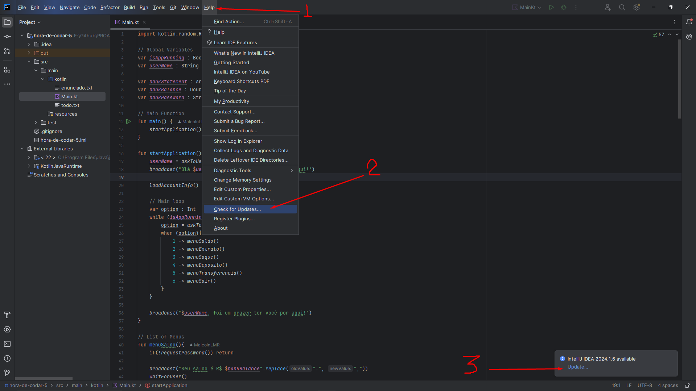
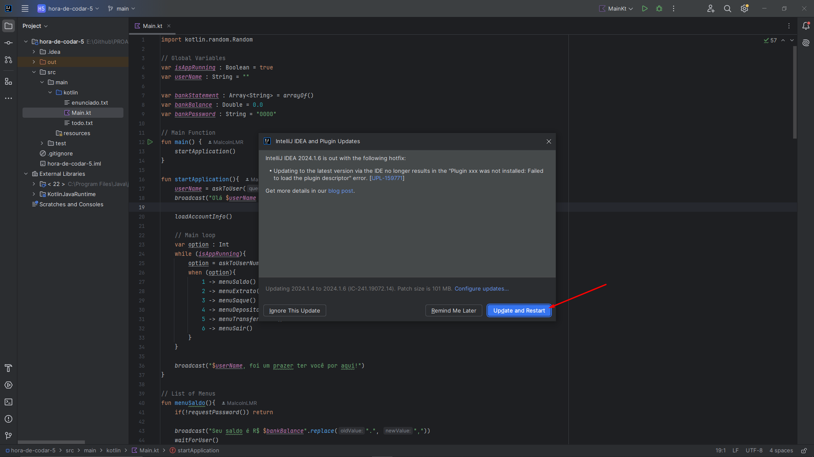
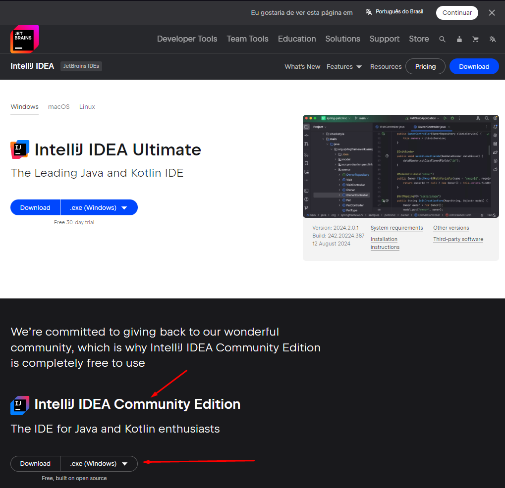

# Como atualizar o IntelliJ no Notebook do PROA!

primeiro, vá até a a aba "Help", escolha a opção "Check for Updates...", e depois clique no "Update"

Após isso você irá 

# Caso isso não funcione

Reinstale o IntellijIDEA
Link para Download: https://www.jetbrains.com/idea/download/?section=windows

Baixar a versão *Community*! pois ela é totalmente gratuita.

# Motivo para funcionar (pra quem tem interesse)
O Kotlin no notebook do PROA está na versão 1.5, e a mais atual com mais funções é a 2.0. E para que seja possível usar a 2.0 é necessário usar uma versão recente intellijIDEA