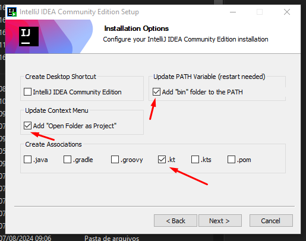
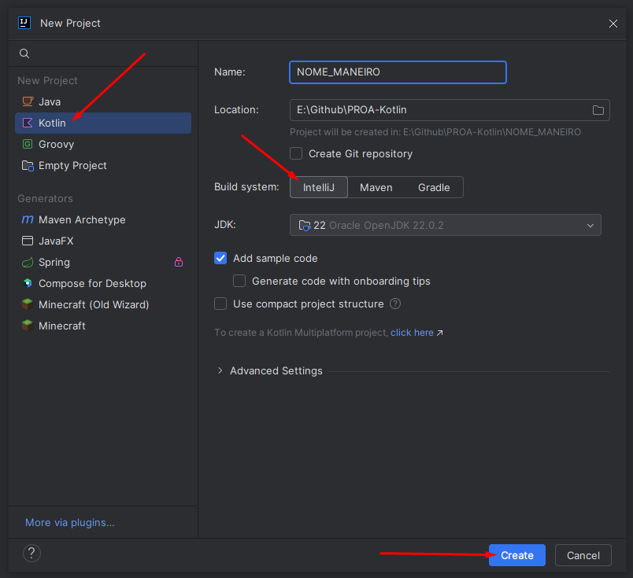
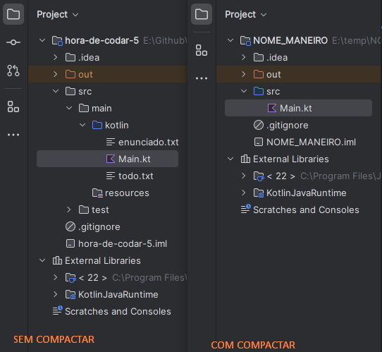
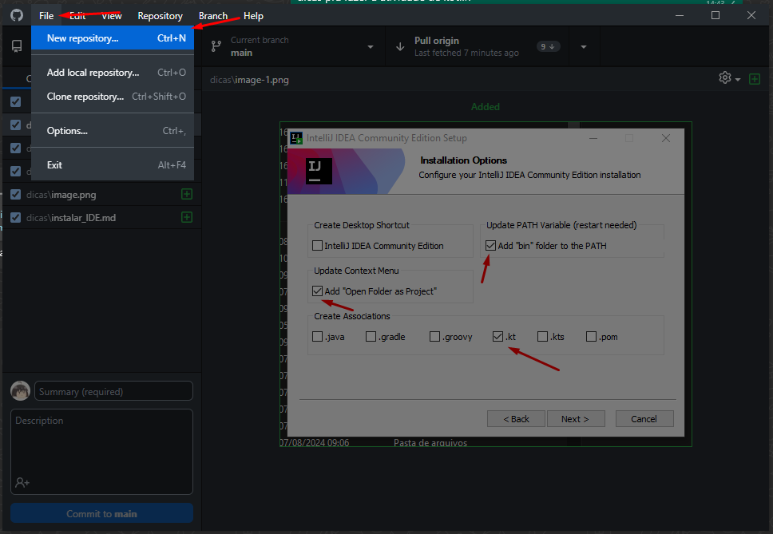
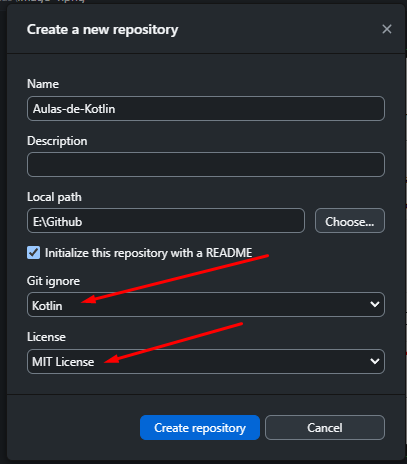

# Guia rapidão de como instalar o Kotlin e começar um projeto

## 1. Instalar o IntellijIDEA
Dá para usar outra IDE, como Eclipse ou VSCode, mas a criadora do IntellijIDEA é a mesma criadora da linguagem Kotlin, logo, é interessante usar ela  

### Baixando
Link para Download: https://www.jetbrains.com/idea/download/?section=windows

Baixar a versão *Community*! pois ela é totalmente gratuita.

### Instalando

*Eu* particularmente recomendo ativar estas opções, pois serão úteis no futuro, mas não são obrigatórias, a ativação ou falta dela não irá impactar a instalação. São apenas melhorias de Qualidade de Vida.  
O resto da instalação são coisas menos importantes, como local de instalação, se inicia com windows, se cria atalho, coisa básica de instalar um programa, dá uma olhadinha e deixa do jeito que achar melhor ou mais organizado.

## 2. Criar um projeto em kotlin
Quando clicar para criar um novo projeto, terá essas opções:

Lembre-se de:  
• Colocar o projeto como Kotlin no menu lateral  
• Colocar um nome que represente o seu projeto (exemplo: hora-de-codar-1)  
• Coloque numa pasta que seja fácil de saber onde está (dica: configura um repositório igual a seção 3, e salva o projeto dentro dele :D)  
• O uso da opção "Use compact project structure" é de cada um, ao deixar desmarcado, a estrutura de pastas fica igual a do java, que é longa e com muita subpasta  

## 3. Criando um repositório pelo GitHub Desktop
Caso ainda não tenha baixado este app: https://github.com/apps/desktop

Primeiramente, entre no aplicativo com a sua conta. Após isso, vá em "File" ou "Arquivo" e crie um novo repositório

Quando estiver criando o repositório, defina um nome decente né, a descrição você pode colocar depois, mas é um resumo muito curto do projeto. O local do projeto será onde ele ficara instalado na sua máquina, então anote ele que você irá criar o projeto de kotlin ali dentro. O Git Ignore é importante de ser configurado, pois ele irá excluir as pastas irrelevantes de serem enviadas aos servidores do github, então selecione a linguagem que estiver usando, que no caso é Kotlin. A licença pra estudos, geralmente é MIT, mas caso queria estudar sobre as outras e pegar outro tipo para o seu código, tamo junto, depois me explica pois só conheço a MIT e a GNU

